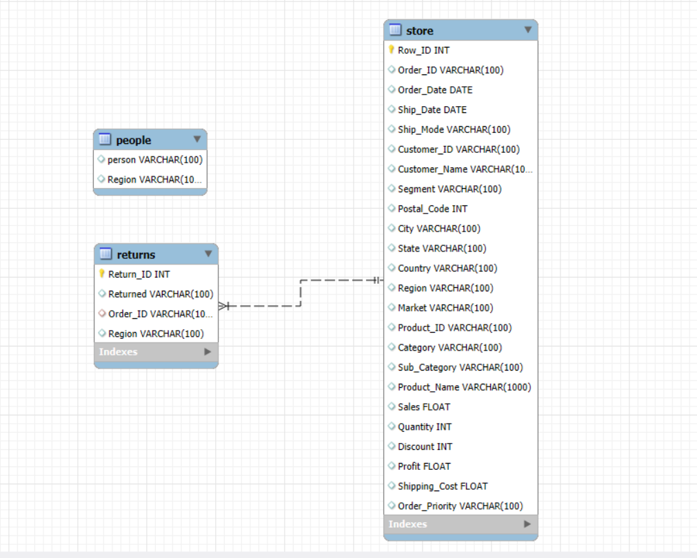

# 📊 Superstore Sales & Profitability Analysis

## 📝 Project Overview
This project performs an end-to-end data analysis on a retail Superstore dataset using **Advanced SQL (MySQL)**. The primary objective is to transform raw sales, customer, and product data into actionable business insights. By analyzing sales trends, customer purchasing behavior, and product return rates, this project aims to help stakeholders identify profitable avenues, mitigate losses from returns, and optimize operational efficiency.

## 🎯 Business Problems Addressed
- **Sales & Revenue Tracking:** What are the month-over-month sales growth rates and running total sales?
- **Profitability Analysis:** Which product categories and regions generate the highest profits, and where are the losses occurring?
- **Customer Behavior (Market Basket Analysis):** Which products are most frequently purchased together?
- **Operational Efficiency:** How do different shipping modes impact delivery delays?
- **Return Rate Impact:** Which products and shipping modes have the highest return rates, and how much profit is lost due to these returns?

## 📂 Dataset Overview
The analysis utilizes three primary datasets:
1. **`order.csv`**: Contains granular transaction data including customer details, product categories, sales, profit, discounts, and shipping modes.
2. **`People.csv`**: Maps regional managers to their respective sales regions.
3. **`Returns.csv`**: Logs returned orders to analyze return rates and associated losses.

## 🗄️ Database Schema
Below is the relational database schema designed for this project:

## 🛠️ Key SQL Techniques Applied
- **Data Cleaning & Transformation:** String manipulation (`REPLACE`), Type Casting (`CAST`, `STR_TO_DATE`), Handling nulls and formatting raw currency values.
- **Window Functions:** `SUM() OVER()`, `RANK()`, `LAG()` for running totals, ranking products, and month-over-month growth calculations.
- **CTEs (Common Table Expressions):** Used to modularize complex queries such as calculating percentage growth.
- **Joins & Aggregations:** Multi-table `JOIN` operations (Store, People, Returns) coupled with `GROUP BY` and `HAVING` clauses to extract summary statistics.
- **Advanced querying:** Market Basket analysis using self-joins to find product pairings.

## 🚀 How to Run the Project
1. Install **MySQL Server** and a client like **MySQL Workbench**.
2. Create a database named `db_sql_projects`.
3. Follow the comprehensive SQL script provided in [`Analysis_using_SQL.md`](./Analysis_using_SQL.md) to:
   - Create the necessary tables.
   - Load the CSV files (`order.csv`, `People.csv`, `Returns.csv`).
   - Execute the data cleaning and exploratory data analysis (EDA) queries.

## 📈 Featured Insights
*Please refer to [`Analysis_using_SQL.md`](./Analysis_using_SQL.md) for the complete SQL code and outputs.*
- **High-Value Returns:** Successfully identified the exact profit lost due to returns across various regions, providing a clear metric for operational improvement.
- **Product Pairings:** Revealed the top 10 most frequent product combinations purchased together (Market Basket Analysis).
- **Delivery Delays:** Calculated the average delivery delay across different shipping modes to assess logistical performance.

---
*This repository showcases advanced SQL querying, data cleaning, and business intelligence reporting.*
